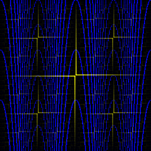

# Convolutions

Image kernels and textures.

Kernels are applied on the individual RGB channels

## Usage

Generate the images:

````
make
./hello
````

hello0.bmp: Initial image - XOR texture + polynomial modulus


hello1.bmp: Gaussian blur


hello2.bmp: Gaussian blur + Edge filter



hello3.bmp: Gaussian blur + Edge filter + Sharpening


hello4.bmp: Gaussian blur + Edge filter + Sharpening + Box blur


